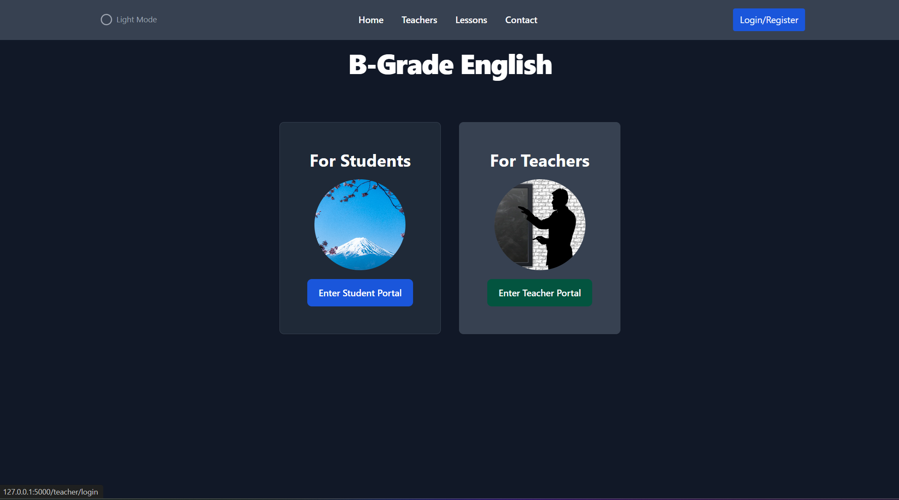

# ESL School Lesson Management System

#### Video Demo: [URL HERE]

## Citing AI-Based Tools

Throughout the development of this project, both ChatGPT and Github CoPilot were used to assist with code generation and troubleshooting, especially with regards to the use of Flask-WTF, and ensuring forms and CSRF tokens were handled correctly.  These tools were used to enhance productivity and provide suggestions but all code was reviewed and integrated by me.  Helper files and app.py route created with extensive AI assistance are clearly marked as being so.  The TailwindCSS and Flowbite libraries provided fairly standard means of choosing a design and color scheme, and some pages were run through ChatGPT to ensure consistency where color changes were made.

## Description

B-Grade English is a web application designed to allow ESL teachers setting up independent English conversation schools (or eikaiwa, as they're known in Japan) a way to enhance the student experience beyond the typical coffee shop lesson, where the lessons are recorded on pen/paper, and lessons are typically agreed via text messages. This offers a platform where teachers can manage their lesson slots (showing off their availability), and students can book lessons based on teacher availability. The system ensures that both teachers and students can view their upcoming and past lessons, manage their profiles, and browse through old lesson records - which are designed to summarize the lesson notes succinctly.

The project uses the following technologies:
- **Flask**: As the web framework.
- **Tailwind CSS**: For styling the web application.  I wanted to use a CSS framework that was easy to use and understand, and Tailwind CSS was perfect for this.
- **Flowbite**: A Tailwind CSS component library that was used to help with the styling of the web application.
- **Flask-Login**: For user authentication.
- **Flask-WTF**: For CSRF protection.
- **WTForms**: For form handling and validation (not 'fun' to learn, and really extended the time on the project).
- **Flask-Migrate**: For handling database migrations.
- **Flask-Limiter**: For rate limiting the registration and login endpoints.  (A feature that was added after the project was completed, but was a good idea to add in the end).
- **SQLite3**: As the database for the project.
- **SQLAlchemy**: For database management (easy scalability from the SQLite3 to MySQL in the future).
- **Pytz**: For timezone management (I wanted the web app to be possible to use anywhere in the world).
- **Github CoPilot**: For code suggestions, generation, and to generate clear helper functions.  For generating ideas and suggestions for the project, especially in the form handling section.
- **ChatGPT**: Again, this was heavily used for generating ideas and suggestions for the project.  Also assisting with improving the 'light mode' styling.

## Features

- User Authentication and Authorization: Separate login and registration routes for students and teachers.

- Teacher Dashboard: View upcoming lessons, recent lesson records, and outstanding lesson records.

- Student Dashboard: View upcoming lessons and recent lesson records.

- Profile Management: Both students and teachers can manage their profile information.

- Lesson Slot Management: Teachers can open and close lesson slots.

- Lesson Booking: Students can book available lesson slots.

- Lesson Cancellation: Students can cancel booked lessons.

- Lesson Record Editing: Teachers can edit lesson records.

- Lesson Record Summaries: Summarized lesson records for easy review.

- Light and Dark Mode: Supports both light and dark themes for better user experience (dark is much better!).

## Setup

To set up the project locally, follow these steps:

1. **Clone the repository:**
    ```sh
    git clone https://github.com/rabogan/project.git
    cd project
    ```

2. **Create a virtual environment and activate it:**
    ```sh
    python -m venv venv
    source venv/bin/activate  # On Windows, use `venv\Scripts\activate`
    ```

3. **Install the dependencies:**
    ```sh
    pip install -r requirements.txt
    ```

4. **Set up the database:**
    ```sh
    flask db upgrade
    ```

5. **Run the application:**
    ```sh
    flask run
    ```

## Usage

### Teacher Portal
- **Register/Login:** Teachers can register for an account and/or log in.
- **Dashboard:** Teachers can view their upcoming lessons, most recent lesson records, and outstanding lesson records.
- **Manage Lesson Slots:** Teachers can open and close lesson slots for students to book.
- **Edit Profile:** Teachers can update their profile information.

### Student Portal
- **Register/Login:** Students can register for an account and/or log in.
- **Dashboard:** Students can view their upcoming lessons and most recent lesson records.
- **Book Lessons:** Students can book available lesson slots with teachers.
- **Edit Profile:** Students can update their profile information.
- **Cancel Lessons:** Students can cancel booked lessons.

## Code Overview

### Application Structure

#### Snake Case Used For Python Functions And Helpers

- `app.py`: The main application file that contains route definitions and the app initialization.
- `database.db`: Initializes the SQLAlchemy and Flask-Migrate extensions for use with the Flask application
- `models.py`: Contains the models that define the database schema.
- `forms.py`: Contains all WTForms form definitions used in the application.
- `helpers/`: Contains helper modules that encapsulate various functionalities.
  - `auth_helpers.py`: Handles user registration and login functionalities.
  - `dashboard_helpers.py`: Contains functions for fetching recent lessons, upcoming lessons, etc.
  - `edit_lesson_record_helpers.py`: Handles lesson record editing functionalities.
  - `file_helpers.py`: Manages file saving functionalities, particularly for profile images.
  - `lesson_record_helpers.py`: Contains functions for managing lesson records.
  - `student_helpers.py`: Includes functions for student-specific functionalities such as profile updates and lesson cancellations.
  - `student_booking_helpers.py`: Manages lesson booking functionalities for students.
  - `teacher_helpers.py`: Contains functions for teacher-specific functionalities.
  - `teacher_lesson_slot_mgmt_helpers.py`: Manages opening and closing lesson slots for teachers.
  - `time_helpers.py`: Handles timezone-related functionalities.
- `templates/`: Contains the HTML templates used for rendering the web pages.

#### Templates Used For HTML Files

## Public Templates (/*.html)
- **layout.html**: This is the main layout file that includes the navigation bar, footer, and main content area. It supports both dark and light modes with consistent styling.
- **display.html**: The home page that welcomes users based on their roles (teachers, students, or guests) and provides navigation options.
- **404.html**: The "Page Not Found" error page that guides users back to the home page.
- **500.html**: The "Server Error" page that informs users of unexpected errors and guides them back to the home page.
- **apology.html**: A template for displaying error messages with a consistent style, including a return link to the home page.
- **developerProfile.html**: A page showcasing my profile.
- **meetYourTeachers.html**: A page where users can view the profiles of all teachers. The page is paginated and allows navigation between different pages of teacher profiles.
- **ourLessons.html**: The "Our Lessons" page provides detailed information about the benefits of one-on-one lessons, instructor availability, and how students can review their lesson records. Includes a section on future possibilities too!
- **portalChoice.html**: The "Portal Choice" page that allows users to choose between the student and teacher portals.
- **studentLogin.html**: The "Student Log In" page that allows students to log in to their accounts.
- **studentRegister.html**: The "Student Register" page that allows new students to create accounts.
- **teacherLogin.html**: The "Teacher Log In" page that allows teachers to log in to their accounts.
- **teacherRegister.html**: The "Teacher Register" page that allows new teachers to create accounts.

## Teacher-Only Templates (/teacher/_*.html)
- **teacherDashboard.html**: The "Teacher Dashboard" page that displays upcoming lessons, recent lesson records, and outstanding lesson records.
- **editTeacherProfile.html**: The "Edit Teacher Profile" page that allows teachers to update their profile information.
- **lessonSlots.html**: The "Lesson Slots" page that allows teachers to manage their lesson slots.
- **editLesson.html**: The "Edit Lesson" page that allows teachers to edit lesson records.
- **teacherLessonRecords.html**: The "Lesson Records" page that displays all lesson records for a teacher.

## Student-Only Template (/student/_*.html)
- **studentDashboard.html**: The "Student Dashboard" page that displays upcoming lessons and recent lesson records.
- **editStudentProfile.html**: The "Edit Student Profile" page that allows students to update their profile information.
- **bookLesson.html**: The "Book Lesson" page that allows students to book available lesson slots.
- **lessonRecords.html**: The "Lesson Records" page that displays all lesson records for a student.

## Shared Non-Public Templates
- **viewStudentProfile.html**: The "Student Profile" page that displays and allows editing of student profile details.
- **viewTeacherProfile.html**: The "Teacher Profile" page that displays teacher profile details.

### Endpoints

#### Public Routes
- **GET /**: Displays the index page.
- **GET /meetYourTeachers**: Shows a gallery of all teachers.
- **GET /ourLessons**: Provides information about the lessons offered.
- **GET /developerProfile**: Provides contact information for the school.
- **GET /teacherProfile/<int:teacher_id>**: Displays a teacher's public profile.

#### Authentication Routes
- **GET, POST /student/register**: Student registration.
- **GET, POST /student/login**: Student login.
- **GET, POST /teacher/register**: Teacher registration.
- **GET, POST /teacher/login**: Teacher login.
- **GET /logout**: Logs out the current user.

#### Teacher Routes
- **GET /teacher/dashboard**: Displays the teacher's dashboard.
- **GET /teacher/lessonRecords**: Displays the teacher's lesson records.
- **GET, POST /teacher/editTeacherProfile**: Allows the teacher to edit their own profile.
- **GET, POST /studentProfile/<int:student_id>**: Allows the teacher to view and edit a specific student's profile.
- **GET /teacher/lessonSlots**: Allows the teacher to manage their lesson slots.
- **POST /teacher/updateSlot**: Updates a lesson slot (open/close).
- **POST /updateSlotStatus**: Updates the status of a lesson slot (open/close).
- **POST /teacher/updateSlots**: Batch updates lesson slots (open/close).
- **GET, POST /teacher/editLesson/<int:lesson_id>**: Allows the teacher to edit a specific lesson record.

#### Student Routes
- **GET /student/dashboard**: Displays the student's dashboard.
- **POST /cancelLesson/<int:lesson_id>**: Cancels a specific lesson that has been booked.
- **GET /student/lessonRecords**: Displays the student's lesson records.
- **GET, POST /student/editStudentProfile**: Allows the student to edit their profile.
- **GET, POST /student/bookLesson**: Allows the student to book a lesson.
- **GET /getSlots/<int:teacher_id>**: Fetches available slots for a teacher of a given teacher ID.

## Design Choices

Throughout the development of this project, several design choices were made to ensure a seamless user experience and maintainable codebase:

1. **Modular Code Structure:** The codebase is organized into multiple helper modules to encapsulate different functionalities and promote code reusability.
2. **User Authentication and Authorization:** Separate login and registration routes for students and teachers ensure appropriate access control.
3. **CSRF Protection and forms:** All forms in the application are protected against CSRF attacks using Flask-WTF.
4. **Timezone Management:** Accurate timezone handling ensures that lesson times are displayed correctly for both teachers and students.
5. **Rate Limiting:** Flask-Limiter is used to prevent abuse of the registration and login endpoints by limiting the number of requests per minute.

## Project Planning

### Objectives

1. **Core Functionality:** Develop a lesson booking system where students can book, view, and cancel lessons, and teachers can manage their availability.
2. **User Management:** Implement secure authentication and profile management for both students and teachers.
3. **User Experience:** Ensure the application is user-friendly with clear navigation and responsive design.

### Skills and Research

- **Flask Framework:** Deepen understanding of Flask and its ecosystem.
- **Database Management:** Efficiently use SQLAlchemy for database interactions.
- **Form Handling:** Utilize WTForms for robust form handling and validation. (Heavily augmented by ChatGPT)
- **Timezone Management:** Accurately handle and display lesson times across different timezones.

### Milestones

1. **Milestone 1:** Set up basic homepage and other static pages for unauthenticated users.
2. **Milestone 2:** Set up dual user authentication with Flask: for teachers and for students.
3. **Milestone 3:** Add profile management features for students and teachers: allowing teachers to edit student profiles too.
4. **Milestone 4:** Implement lesson booking and management features for students and teachers.
5. **Milestone 5:** Implement lesson record editing and viewing features for teachers and students.
6. **Milestone 6:** Finalize UI/UX and ensure the application is fully responsive.
7. **Milestone 7:** Write comprehensive documentation and create a video demo.

## Future Possibilities

There are several enhancements and features that could be added to this project in the future. Space (albeit commented out) has already been given to these in the layout.html!

1. **Allow Users To Change Their Password:** Set up a server that allows users to change their password for any reason.
2. **Payment System:** Interact with 3rd party libraries (Stripe/Petal) to allow online purchasing of lessons.
3. **Flashcard System:** Interact with the Anki API: allows the 'new_words' and 'new_phrases' to be automatically added to the student's Anki deck. with a suitable translation.
4. **Multi-Language Support:** Add support for other languages: French, Spanish, and Italian are regularly taught in Japan.
5. **Mobile App:** Using Electron, develop a mobile app version of the platform for easier access on mobile devices.
6. **Video Lesson Integration:** Integrate with video conferencing tools like Zoom or Google Meet to facilitate online lessons.
7. **Teacher Cancellation System:** Allow teachers to cancel lesson bookings and notify students automatically.
8. **ChatBot:** Much like the Duck Debugger in CS50, a chatbot could be used to help students outside of lesson times.
9. **Pronunciation Helper:** Using a 3rd party API that compares student pronunciation of words (entered into a section in the lesson record), and helps them improve.

## Citing AI-Based Tools

Throughout the development of this project, AI-based tools like ChatGPT were used to assist with code generation and troubleshooting. These tools were used to enhance productivity and provide suggestions but all code was reviewed and integrated by the project developers.

## Additional Information

- **Helpful Resources**:
  - [Tailwind CSS Installation](https://tailwindcss.com/docs/installation)
  - [Flowbite Flask Integration](https://flowbite.com/docs/getting-started/flask/)
  - [TW Elements Social Buttons](https://tw-elements.com/docs/standard/components/social-buttons/)
  - [How I Adjusted My Database To Store New Words And Phrases](https://stackoverflow.com/questions/55056253/what-is-the-best-way-to-save-a-string-array-in-sqlite-on-android/)
  - [Use of jQuery and AJAX with teacher lesson slot management](https://learn.jquery.com/ajax/ajax-and-forms/)

## Security Notes

CSRF protection is an important part of securing your web application, but it's not directly related to preventing SQL Injection attacks. CSRF (Cross-Site Request Forgery) protection is about preventing unauthorized commands from being transmitted from a user that the web application trusts.

SQL Injection is prevented in Flask by using the SQLAlchemy ORM for database queries. SQLAlchemy automatically escapes any variables that are passed into a query, which prevents SQL Injection attacks. In your code, you're using SQLAlchemy, so as long as you're not manually constructing SQL queries with string concatenation or formatting, you should be safe from SQL Injection attacks.
